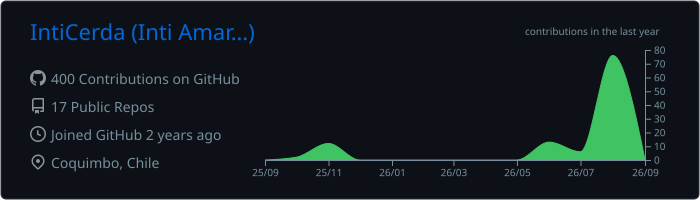
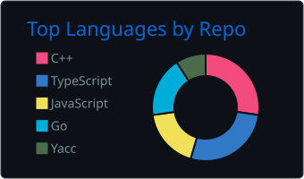
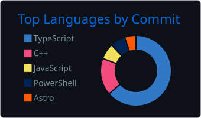

<h1 align="center"><b>Hi, Inti Cerda here </b></h1>

<h2 align="center">
    ╔═══════════════╗ 
    🎮 Hi there 
    ╚═══════════════╝
</h2>

- ⭐ **Full-stack developer** — backend at heart, shipping products end to end
- 🎓 **Computer Engineering** graduate from Universidad Católica del Norte (Chile)
- 🛠️ Building **SaaS products from scratch**: scraping engines, microservices, event-driven pipelines and dashboards
- 💀 Most of my work lives in **private repositories** — happy to talk about it

<h2 align="center">
    ╔═══════════════╗ 
    🚀 What I'm Building 
    ╚═══════════════╝
</h2>

- 🗞️ **Media Intelligence Platform** — national news monitoring SaaS: a 15-repo microservices ecosystem with a Playwright + LLM classification engine, FastAPI services, a Redis Streams event bus, JWT auth, billing, and Next.js 15 dashboards
- 🛡️ **Compliance Monitor** — reputational-risk and compliance monitoring for regulated industries, built on the same engine with its own dashboard and auth boundary
- 📊 Full observability stack: Prometheus, Grafana, alerting — because if you can't measure it, it's broken

<h3 align="center">
    ╔═══════════════╗ 
    ⚔️ Tech Stack 
    ╚═══════════════╝
</h3>

- **Languages**:

  
  
  
  
  

- **Backend**:

  
  
  
  
  

- **Frontend**:

  
  
  

- **AI & Agents**:

  
  
  
  

- **Infra & Data**:

  
  
  
  
  
  

 

<h2 align="center">
    ╔═══════════════╗ 
    📊 GitHub Stats 
    ╚═══════════════╝
</h2>

  

  
  

  

<h2 align="center">
    ╔═══════════════╗ 
    🔗 Let's Connect 
    ╚═══════════════╝
</h2>

  
  

<picture>
  <source media="(prefers-color-scheme: dark)" srcset="https://raw.githubusercontent.com/IntiCerda/IntiCerda/output/github-snake-dark.svg">
  
</picture>
